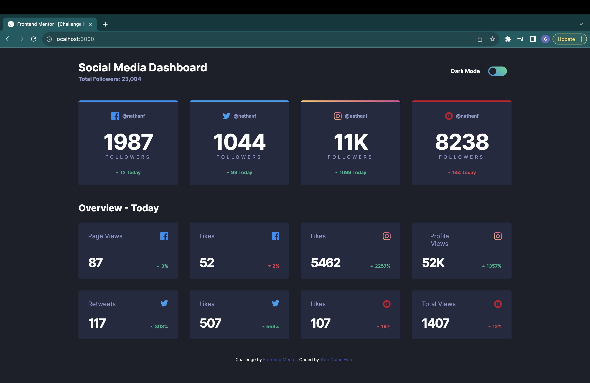
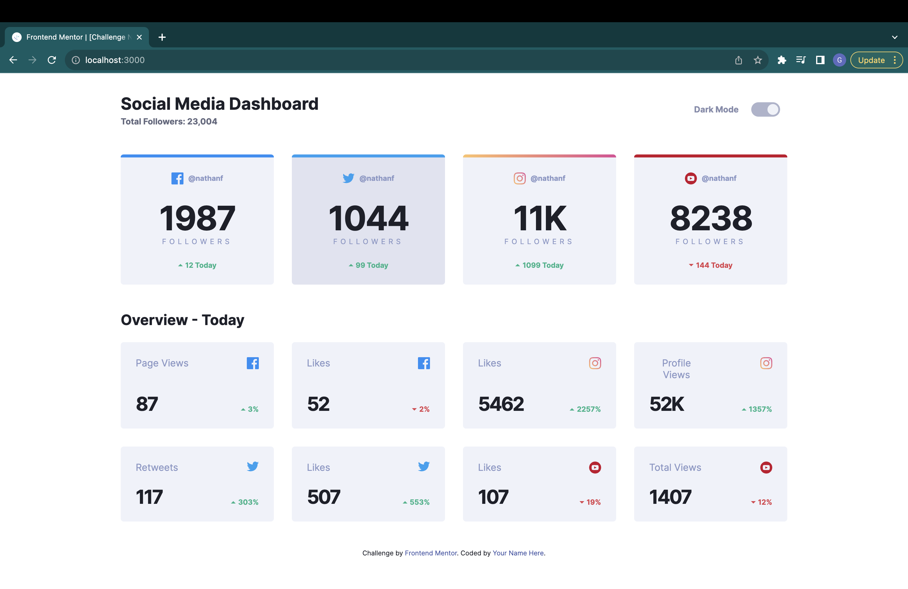

# Frontend Mentor - Social media dashboard with theme switcher solution

This is a solution to the [Social media dashboard with theme switcher challenge on Frontend Mentor](https://www.frontendmentor.io/challenges/social-media-dashboard-with-theme-switcher-6oY8ozp_H). Frontend Mentor challenges help you improve your coding skills by building realistic projects. 

## Table of contents

- [Overview](#overview)
  - [The challenge](#the-challenge)
  - [Screenshot](#screenshot)
  - [Links](#links)
- [My process](#my-process)
  - [Built with](#built-with)
  - [What I learned](#what-i-learned)
  - [Continued development](#continued-development)
  - [Useful resources](#useful-resources)
- [Acknowledgments](#acknowledgments)

## Overview

### The challenge

Users should be able to:

- View the optimal layout for the site depending on their device's screen size
- See hover states for all interactive elements on the page
- Toggle color theme to their preference

### Screenshot




### Links

- Live Site URL: (Will be added soon) 

## My process

### Built with

- Semantic HTML5 markup
- CSS custom properties
- Flexbox
- CSS Grid
- Mobile-first workflow
- Scss
- JavaScript
- Gulp Workflow
- Block Element Modifier approach


### What I learned

My major learnings has been how to properly structure my approach towards HTML markup and how each of the tags interact with css properties. 

```
<div class="card card-grid">
  <div class="'card__subtitle">Page Views</div>
  
  <div class= 'card__count card__count--small'>87</div>
  <div class="card__change card__change--up">
    
    <div class="'card__number">3%</div>
  </div>
</div>
```

This code for one of the smaller cards in the overview section of the website, here i used the BEM approach to first lay out the requirements of my program and how it needs to be styled. I wrote down the classes I can use to differentiate each of the elements taht need to be styled differently. 

I then used these classes to write systematic scss to style the html markup

This is an example of that approach
```
.card{
  position: relative;
  overflow: hidden;
  background: var(--card-bg);

  &--facebook{
      border-top: torem(5) solid var(--facebook);
  }
  &--twitter{
      border-top: torem(5) solid var(--twitter);
  }
}   
```

I also learned concepts such as local Storage, and "breakpoints" that alter css based on the width of the screen to adapth the website based on the device viewport. 

### Continued development

I would like to focus more on javascript and css in my future projects. As of now I am not very comfortable with my skills  in them to be able to create a responsive website. This will help me to move on from a static webpage to a dynamic site.

**Note: Delete this note and the content within this section and replace with your own plans for continued development.**

### Useful resources

- [CoderCoder](https://youtu.be/krfUjg0S2uI) - This tutorial guided me at times when I was stuck and helped me form an approach and structure I could use to complete the challenge.
- [piccali](https://piccalil.li/tutorial/create-a-user-controlled-dark-or-light-mode/) - This was a great resource to understand how to implement the dark/light mode toggle.

## Acknowledgments

Completed by following the tutorial created by @TheCoderCoder at [freecodecamp youtube](https://youtu.be/krfUjg0S2uI).
